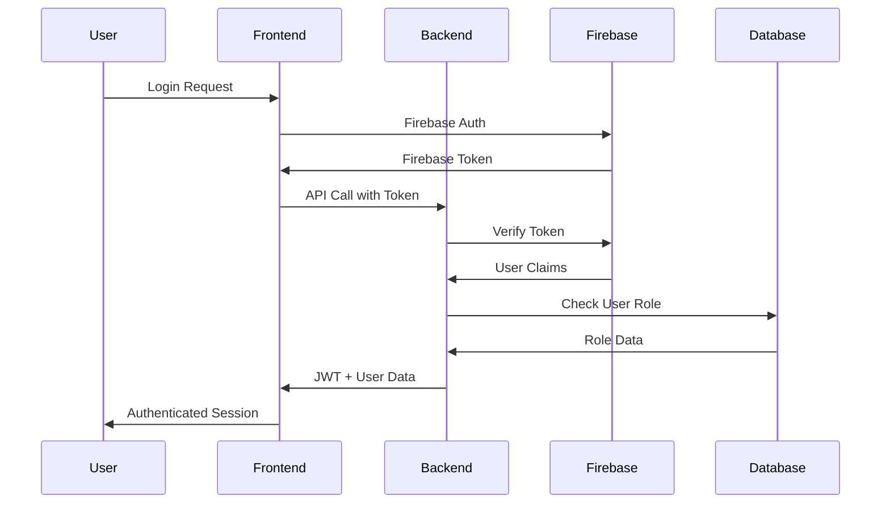

# Semprepzie - Educational Document Management Platform

> A modern full-stack educational platform designed to help students organize and access PDFs in a structured manner with role-based access control, offline caching, and interactive coding environments.

## 🎯 Project Overview

**Semprepzie** is a comprehensive educational platform that solves the problem of unorganized PDF storage for students. The platform provides:

- **Structured Document Access**: Branch-specific login for students with organized PDF collections
- **Intelligent Caching**: Local storage system for offline PDF access
- **Admin Management**: High-authority users can upload and manage documents directly
- **Interactive Lab Environment**: Code editor with execution capabilities for programming practice
- **Progressive Web App**: Offline-first approach with service worker caching

## 🔧 Recent Updates & Fixes

### ✅ **Code Execution Improvements** (Latest)
- **Enhanced Caching**: Reduced cache duration to 5 minutes for accurate results
- **API Limits**: 
  - Judge0: 50 executions/day (free tier)
  - OneCompiler: 100 executions/day
  - Python (Pyodide): Unlimited offline execution
- **Better Cache Keys**: Include timestamps to prevent false cache hits
- **Usage Tracking**: Real-time API usage statistics with visual indicators

### ✅ **Dark Mode Consistency**
- **Unified Theme System**: Code editor now follows main app dark mode
- **No Separate Toggles**: Removed individual editor theme buttons
- **Dynamic UI**: All components adapt to light/dark theme automatically

### ✅ **Bug Fixes**
- **Cache Corruption**: Fixed C/C++ programs showing wrong cached outputs
- **Theme Synchronization**: Editor theme now syncs with main app instantly
- **Error Handling**: Better API failure recovery and user feedback

## 🏗️ Architecture Overview

```
┌─────────────────┐    ┌─────────────────┐    ┌─────────────────┐
│    Frontend     │    │     Backend     │    │   External      │
│   (React/TS)    │◄──►│   (Node.js/TS)  │◄──►│   Services      │
│                 │    │                 │    │                 │
│ • React 18      │    │ • Express.js    │    │ • Firebase Auth │
│ • TypeScript    │    │ • TypeScript    │    │ • Firebase Store│
│ • Vite          │    │ • JWT           │    │ • Supabase DB   │
│ • Tailwind CSS  │    │ • Validation    │    │ • Supabase Store│
│ • PWA           │    │ • Rate Limiting │    │ • Nodemailer    │
└─────────────────┘    └─────────────────┘    └─────────────────┘
        │                       │                       │
        ▼                       ▼                       ▼
┌─────────────────┐    ┌─────────────────┐    ┌─────────────────┐
│  Service Worker │    │   Middleware    │    │   Databases     │
│                 │    │                 │    │                 │
│ • PDF Caching   │    │ • Auth Guard    │    │ • Firestore     │
│ • Offline Mode  │    │ • Error Handler │    │ • Supabase      │
│ • Background    │    │ • CORS Config   │    │ • File Storage  │
│   Sync          │    │ • Compression   │    │                 │
└─────────────────┘    └─────────────────┘    └─────────────────┘
```

## 🛠️ Technology Stack

### Frontend Technologies

#### 🚀 **React 18 + TypeScript**
- **Purpose**: Modern UI library with type safety
- **How it works**: 
  - Component-based architecture for reusable UI elements
  - Hooks for state management and side effects
  - Context API for global state (authentication, themes)
  - TypeScript provides compile-time type checking

#### ⚡ **Vite Build Tool**
- **Purpose**: Fast development and optimized builds
- **How it works**:
  - Hot Module Replacement (HMR) for instant development feedback
  - ES modules for faster cold starts
  - Optimized production builds with code splitting
  - Plugin ecosystem for enhanced functionality

#### 🎨 **Tailwind CSS**
- **Purpose**: Utility-first CSS framework
- **How it works**:
  - Pre-built utility classes for rapid UI development
  - Custom design system with consistent spacing and colors
  - Responsive design utilities for mobile-first approach
  - PurgeCSS integration to remove unused styles

#### 📱 **Progressive Web App (PWA)**
- **Purpose**: Native app-like experience in browsers
- **How it works**:
  - Web App Manifest for installability
  - Service Worker for offline functionality
  - Background sync for data updates
  - Push notifications capability

### Backend Technologies

#### 🟢 **Node.js + Express.js**
- **Purpose**: Server-side JavaScript runtime and web framework
- **How it works**:
  - RESTful API endpoints for client-server communication
  - Middleware pipeline for request processing
  - Asynchronous programming with async/await
  - File serving for static assets and documents

#### 🔐 **JSON Web Tokens (JWT)**
- **Purpose**: Stateless authentication mechanism
- **How it works**:
  - Token-based authentication for API security
  - Payload contains user information and permissions
  - Signed tokens prevent tampering
  - Short-lived access tokens with refresh capability

#### 🛡️ **Security Middleware Stack**
- **Helmet**: Sets security-related HTTP headers
- **CORS**: Configures cross-origin resource sharing
- **Rate Limiting**: Prevents abuse and DoS attacks
- **Input Validation**: Sanitizes and validates user input

### Database & Storage

#### 🔥 **Firebase Ecosystem**

##### **Firebase Authentication**
- **Purpose**: User authentication and authorization
- **How it works**:
  - Email/password authentication with verification
  - Role-based access control (student, admin)
  - Restricted domain login (@aitsrajampet.ac.in only)
  - Device management and session control
  - Integration with custom JWT tokens for API access

##### **Firestore Database**
- **Purpose**: NoSQL document database for real-time data
- **How it works**:
  - Document-based storage with collections
  - Real-time listeners for live data updates
  - Offline persistence with automatic sync
  - Security rules for data access control
  - Scalable with automatic multi-region replication

##### **Firebase Storage**
- **Purpose**: File storage for uploaded documents
- **How it works**:
  - Cloud storage with CDN distribution
  - Direct upload from client with signed URLs
  - Automatic image optimization and resizing
  - Access control with Firebase Authentication
  - Integration with Firestore for metadata

#### 🗄️ **Supabase Integration**

##### **Supabase Database (PostgreSQL)**
- **Purpose**: Structured relational data storage
- **How it works**:
  - PostgreSQL database with RESTful API
  - Row Level Security (RLS) for access control
  - Real-time subscriptions for live updates
  - Full-text search capabilities
  - Database migrations and schema management

```sql
-- Example Schema Structure
subjects (id, name, icon, created_at)
├── units (id, subject_id, name, created_at)
    └── documents (id, unit_id, title, type, url, uploaded_at)
```

##### **Supabase Storage**
- **Purpose**: Alternative file storage solution
- **How it works**:
  - S3-compatible object storage
  - Public and private buckets
  - Automatic image transformations
  - CDN integration for fast delivery
  - Direct upload with presigned URLs

### Caching & Offline System

#### 🔄 **Service Worker Architecture**
- **Purpose**: Offline-first functionality and background processing
- **How it works**:
  ```javascript
  // Cache Strategy Implementation
  const CACHE_HIERARCHY = {
    STATIC_CACHE: 'app-shell-v1',      // HTML, CSS, JS
    PDF_CACHE: 'documents-v1',         // PDF files
    DATA_CACHE: 'api-data-v1',         // API responses
    DYNAMIC_CACHE: 'dynamic-v1'        // User-generated content
  };
  ```

#### 📄 **Document Cache Manager**
- **Purpose**: Intelligent PDF caching system
- **How it works**:
  - First access: Downloads and caches PDF locally
  - Subsequent access: Serves from cache instantly
  - Background sync for updated documents
  - Storage quota management with LRU eviction
  - Cache status indicators for users

### Development Environment

#### 🔧 **Monorepo Structure with Workspaces**
```json
{
  "workspaces": ["frontend", "backend", "shared"],
  "scripts": {
    "dev": "concurrently \"npm run dev:backend\" \"npm run dev:frontend\"",
    "build": "npm run build:shared && npm run build:backend && npm run build:frontend"
  }
}
```

#### 📦 **Shared Package System**
- **Purpose**: Type definitions and utilities shared between frontend/backend
- **How it works**:
  - Common TypeScript interfaces and types
  - Shared validation schemas
  - Utility functions used across layers
  - Consistent API contracts

### Code Execution Environment

#### 🐍 **Pyodide Integration**
- **Purpose**: Python code execution in the browser
- **How it works**:
  - WebAssembly-based Python interpreter
  - Runs entirely in the browser (no server needed)
  - Access to scientific libraries (NumPy, Pandas)
  - Secure execution environment

#### 💻 **CodeMirror Editor**
- **Purpose**: Advanced code editing capabilities
- **How it works**:
  - Syntax highlighting for C/C++/Python
  - Code completion and error detection
  - Themes (light/dark) with custom styling
  - Line numbers, bracket matching, search/replace

### Communication & Notifications

#### 📧 **Nodemailer Integration**
- **Purpose**: Email communication system
- **How it works**:
  - SMTP integration with Gmail
  - HTML email templates
  - Contact form submissions
  - Administrative notifications
  - Error reporting via email

## 🔐 Authentication Flow



### User Authentication Process

1. **Email Validation**: Only @aitsrajampet.ac.in emails allowed
2. **Firebase Authentication**: Secure token-based auth
3. **Role Assignment**: Students/Admins get different permissions
4. **Device Registration**: New devices require email verification
5. **Session Management**: JWT tokens for API access

## 📁 Document Management System

### Document Storage Strategy

```
Document Sources:
├── Supabase Storage (Primary)
│   ├── Public Bucket: /pdfs/*
│   ├── CDN Delivery
│   └── Direct Access URLs
├── Google Drive (Legacy)
│   ├── Public Links
│   ├── Embedded Viewer
│   └── Download Links
└── Local Cache
    ├── Service Worker Cache
    ├── IndexedDB Storage
    └── Quota Management
```

### PDF Viewing Architecture

#### **PDF.js Integration**
- **Purpose**: Native PDF rendering in browsers
- **How it works**:
  - WebWorker-based PDF parsing
  - Canvas rendering for high-quality display
  - Text layer for selection and search
  - Annotation support and form filling
  - Mobile-optimized touch controls

#### **Microsoft Office Viewer**
- **Purpose**: Online viewing of Office documents
- **How it works**:
  - Integration with Office Online
  - Embedded iframe viewers
  - Direct document streaming
  - Cross-platform compatibility

### Cache Management System

#### **Multi-Level Caching**
```typescript
interface CacheStrategy {
  L1: 'Memory Cache',      // Fastest access
  L2: 'IndexedDB',         // Persistent browser storage
  L3: 'Service Worker',    // Network cache
  L4: 'CDN',              // Content delivery network
  L5: 'Origin Server'      // Source storage
}
```

#### **Intelligent Cache Policies**
- **PDF Files**: Cache on first view, serve locally thereafter
- **API Data**: Cache with TTL, background refresh
- **Static Assets**: Long-term cache with versioning
- **User Data**: Session-based cache with encryption

## 🔧 Admin Management System

### Role-Based Access Control

#### **Admin Capabilities**
- **Document Upload**: Direct PDF upload to Supabase storage
- **User Management**: View user activity and device registrations
- **Content Management**: Edit document metadata and categories
- **Lab Programs**: Create and manage coding exercises
- **System Monitoring**: View cache status and performance metrics

#### **Admin Dashboard Features**
```typescript
interface AdminFeatures {
  documentUpload: {
    bulkUpload: boolean;
    metadataEdit: boolean;
    categoryManagement: boolean;
  };
  labManagement: {
    programCreation: boolean;
    codeTemplates: boolean;
    testCaseManagement: boolean;
  };
  userManagement: {
    viewUsers: boolean;
    manageRoles: boolean;
    deviceTracking: boolean;
  };
}
```

### Lab Program Management

#### **Interactive Coding Environment**
- **Multi-Language Support**: Python, C, C++
- **Code Templates**: Pre-built starting code for exercises
- **Test Cases**: Automated verification of solutions
- **Progress Tracking**: Student completion analytics

## 🌐 Deployment & DevOps

### Build Pipeline

#### **Development Workflow**
```bash
# Install dependencies
npm run install:all

# Start development servers
npm run dev  # Runs both frontend and backend

# Type checking
npm run type-check

# Linting and formatting
npm run lint && npm run format

# Production build
npm run build
```

#### **Production Optimization**
- **Code Splitting**: Automatic chunk splitting for optimal loading
- **Tree Shaking**: Remove unused code from bundles
- **Compression**: Gzip/Brotli compression for static assets
- **CDN Integration**: Global content delivery
- **Lazy Loading**: Components and routes loaded on demand

### Environment Configuration

#### **Environment Variables**
```env
# Firebase Configuration
VITE_FIREBASE_API_KEY=...
VITE_FIREBASE_PROJECT_ID=...

# Supabase Configuration
VITE_SUPABASE_URL=...
VITE_SUPABASE_ANON_KEY=...

# Backend Configuration
PORT=3001
JWT_SECRET=...
NODE_ENV=production
```

## 📊 Performance Optimizations

### Frontend Optimizations

#### **Bundle Optimization**
```javascript
// Vite Configuration for Performance
export default defineConfig({
  build: {
    rollupOptions: {
      output: {
        manualChunks: {
          vendor: ['react', 'react-dom'],
          router: ['react-router-dom'],
          firebase: ['firebase/app', 'firebase/auth'],
          ui: ['lucide-react']
        }
      }
    }
  }
});
```

#### **Memory Management**
- **Lazy Loading**: Components loaded only when needed
- **Image Optimization**: WebP format with fallbacks
- **Memory Cleanup**: Proper component unmounting
- **Virtual Scrolling**: For large document lists

### Backend Optimizations

#### **API Performance**
- **Response Compression**: Gzip middleware for all responses
- **Request Caching**: Redis integration for frequently accessed data
- **Database Optimization**: Indexed queries and connection pooling
- **Rate Limiting**: Protect against abuse while maintaining performance

## 🔒 Security Implementation

### Security Layers

#### **Client-Side Security**
- **XSS Protection**: Sanitized user inputs and CSP headers
- **CSRF Protection**: Token-based request validation
- **Secure Storage**: Encrypted local storage for sensitive data
- **Input Validation**: Client and server-side validation

#### **Server-Side Security**
- **Authentication**: Multi-factor Firebase authentication
- **Authorization**: Role-based access control
- **Data Validation**: Schema validation with Joi
- **Security Headers**: Helmet.js for comprehensive protection

#### **Infrastructure Security**
- **HTTPS Only**: Forced SSL/TLS encryption
- **Environment Variables**: Secure configuration management
- **Database Security**: Row-level security and prepared statements
- **File Upload Security**: Type validation and virus scanning

## 🚀 Getting Started

### Prerequisites
- Node.js 18+ and npm 9+
- Firebase project with Auth and Firestore enabled
- Supabase project with database and storage configured

### Installation & Setup

1. **Clone and Install**
   ```bash
   git clone <repository-url>
   cd semprepzie
   npm run install:all
   ```

2. **Environment Configuration**
   ```bash
   # Frontend (.env)
   cp frontend/.env.example frontend/.env
   # Configure Firebase and Supabase credentials

   # Backend (.env)
   cp backend/.env.example backend/.env
   # Configure server settings and API keys
   ```

3. **Database Setup**
   ```bash
   # Run Supabase migrations
   npx supabase db reset
   
   # Initialize Firestore with security rules
   firebase deploy --only firestore:rules
   ```

4. **Development Server**
   ```bash
   npm run dev
   # Frontend: http://localhost:5173
   # Backend: http://localhost:3001
   ```

### Production Deployment

```bash
# Build all packages
npm run build

# Start production server
npm start

# Optional: Deploy to cloud platforms
npm run deploy
```

## 📈 Future Enhancements

### Planned Features
- **AI-Powered Search**: Semantic search across PDF content
- **Collaborative Features**: Document annotations and sharing
- **Mobile App**: React Native version for native mobile experience
- **Analytics Dashboard**: Usage analytics and insights
- **Integration APIs**: LMS integration capabilities
- **Offline Sync**: Robust offline-first architecture

### Technical Improvements
- **Performance**: Database query optimization and caching strategies
- **Scalability**: Microservices architecture for horizontal scaling
- **Security**: Advanced threat detection and response
- **Monitoring**: Comprehensive logging and alerting system

---

## 👥 Team & Contribution

**Semprepzie** is developed by a dedicated team focused on improving educational accessibility through technology. The platform demonstrates modern full-stack development practices while solving real-world problems for students and educators.

### Architecture Benefits
- **Maintainable**: Clear separation of concerns and modular design
- **Scalable**: Microservices-ready architecture with cloud-native principles
- **Secure**: Multiple security layers and best practices implementation
- **Fast**: Optimized for performance with caching and CDN integration
- **Reliable**: Offline-first approach with robust error handling

This comprehensive platform showcases the integration of multiple modern technologies to create a seamless, secure, and efficient educational tool that serves students and administrators effectively.

## 🚀 Features

### 🔐 Authentication
- **Firebase Authentication** with email/password
- **Password reset** functionality
- **Role-based access control** (student, admin, instructor)
- **Restricted login** (only @aitsrajampet.ac.in emails)
- **Device management** and session control
- **Email verification** for new devices

### 📄 Document Management
- **PDF.js** integration for PDF viewing
- **Microsoft Office Online Viewer** for Word/Excel/PowerPoint files
- **Google Drive** document integration
- **File compression/decompression** for faster loading
- **Document categories** and tagging
- **Search and filtering** capabilities

### 📧 Contact System
- **Nodemailer** integration with Gmail SMTP
- **Input validation** and sanitization
- **Rate limiting** for spam protection
- **HTML email templates**

### 🛡️ Security & Performance
- **Helmet** for security headers
- **CORS** configuration
- **Rate limiting** on all endpoints
- **Request validation** with express-validator
- **Compression** for static files
- **Error handling** and logging

## 🏗️ Original Architecture

### Project Structure
```
semprepzie-v2/
├── frontend/                 # React + Vite + TypeScript
│   ├── src/
│   │   ├── components/      # Reusable UI components
│   │   ├── pages/          # Page components
│   │   ├── hooks/          # Custom React hooks
│   │   ├── services/       # API services
│   │   ├── contexts/       # React contexts
│   │   ├── utils/          # Utility functions
│   │   └── styles/         # Tailwind CSS styles
│   ├── public/             # Static assets
│   └── package.json
├── backend/                 # Express.js + TypeScript
│   ├── src/
│   │   ├── controllers/    # Route controllers
│   │   ├── middlewares/    # Express middlewares
│   │   ├── routes/         # API routes
│   │   ├── services/       # Business logic services
│   │   ├── utils/          # Utility functions
│   │   └── server.ts       # Main server file
│   └── package.json
├── shared/                  # Shared types and constants
│   ├── src/
│   │   ├── types/          # TypeScript interfaces
│   │   └── constants/      # Shared constants
│   └── package.json
└── package.json            # Root package.json (workspaces)
```

### Technology Stack

#### Frontend
- **React 18** with TypeScript
- **Vite** for fast development and building
- **Tailwind CSS** for styling
- **React Router** for routing
- **React Hook Form** for form handling
- **React Query** for state management
- **Firebase SDK** for authentication
- **PDF.js** for PDF viewing
- **Axios** for HTTP requests

#### Backend
- **Express.js** with TypeScript
- **Firebase Admin SDK** for secure authentication
- **Nodemailer** for email sending
- **Helmet** for security
- **Express Rate Limit** for rate limiting
- **Winston** for logging
- **Joi** for validation
- **Node-cron** for scheduled tasks

## 🛠️ Installation & Setup

### Prerequisites
- Node.js 18+ and npm 9+
- Firebase project with Authentication enabled
- Gmail account with App Password for SMTP

### 1. Clone and Install
```bash
# Clone the repository
git clone <repository-url>
cd semprepzie-v2

# Install all dependencies
npm run install:all
```

### 2. Environment Configuration

Copy `.env.example` to `.env` and fill in your configuration:

```bash
cp .env.example .env
```

Required environment variables:
- `FIREBASE_PROJECT_ID` - Your Firebase project ID
- `FIREBASE_PRIVATE_KEY` - Firebase Admin SDK private key
- `FIREBASE_CLIENT_EMAIL` - Firebase Admin SDK client email
- `EMAIL_USER` - Gmail address
- `EMAIL_PASS` - Gmail App Password

### 3. Firebase Setup

1. Create a Firebase project at [Firebase Console](https://console.firebase.google.com)
2. Enable Authentication → Sign-in method → Email/Password
3. Generate a service account key:
   - Go to Project Settings → Service Accounts
   - Generate new private key
   - Download the JSON file
4. Copy the values to your `.env` file

### 4. Gmail SMTP Setup

1. Enable 2-Factor Authentication on your Gmail account
2. Generate an App Password:
   - Go to Google Account Settings → Security
   - Generate App Password for "Mail"
   - Use this password in `EMAIL_PASS`

## 🚀 Development

### Start Development Servers
```bash
# Start both frontend and backend
npm run dev

# Or start individually
npm run dev:frontend  # http://localhost:5173
npm run dev:backend   # http://localhost:3001
```

### Build for Production
```bash
# Build everything
npm run build

# Build individual packages
npm run build:frontend
npm run build:shared
```

### Available Scripts
```bash
npm run dev              # Start both dev servers
npm run build            # Build all packages
npm run start            # Start production backend
npm run lint             # Lint all packages
npm run type-check       # TypeScript type checking
npm run format           # Format code with Prettier
npm run clean            # Clean all node_modules
```

## 📚 API Documentation

### Authentication Endpoints
- `POST /api/auth/login` - User login validation
- `POST /api/auth/signup` - Create new account
- `POST /api/auth/verify-token` - Verify Firebase token
- `POST /api/auth/reset-password` - Password reset
- `GET /api/auth/profile` - Get user profile (protected)

### Document Endpoints
- `GET /api/documents` - List documents with pagination
- `GET /api/documents/:id` - Get specific document
- `GET /api/documents/:id/metadata` - Get document metadata
- `POST /api/documents/upload` - Upload document (protected)
- `DELETE /api/documents/:id` - Delete document (protected)

### Contact Endpoints
- `POST /api/contact/submit` - Submit contact form

### Device Management
- `POST /api/devices/register` - Register device
- `GET /api/devices` - List user devices (protected)
- `POST /api/devices/count` - Get device count
- `POST /api/devices/logout-others` - Logout other devices

## 🔒 Security Features

### Authentication Security
- Firebase token verification on backend
- Email domain restriction (@aitsrajampet.ac.in)
- Device tracking and management
- Session management

### API Security
- Rate limiting on all endpoints
- CORS configuration
- Helmet security headers
- Input validation and sanitization
- Error handling without information leakage

### Document Security
- User-based access control
- Email verification required for uploads
- File type validation
- Size limits

## 📱 Document Viewer Features

### PDF Documents
- **PDF.js** integration
- Zoom controls
- Page navigation
- Download functionality
- Search within document

### Office Documents
- **Microsoft Office Online Viewer**
- Support for Word, Excel, PowerPoint
- View-only mode
- Responsive design

### Google Drive Integration
- Direct Google Drive file viewing
- Automatic file type detection
- Compressed loading for performance

## 🎨 UI/UX Features

### Design System
- **Tailwind CSS** for consistent styling
- **Responsive design** for all devices
- **Dark/Light mode** support
- **Loading states** and skeletons
- **Error boundaries** and fallbacks

### User Experience
- **Fast loading** with Vite
- **Optimistic updates**
- **Toast notifications**
- **Form validation** with real-time feedback
- **Keyboard navigation** support

## 🚀 Deployment

### Backend Deployment (Render/Railway/Vercel)
1. Set environment variables
2. Build the backend: `cd backend && npm run build`
3. Start command: `node dist/server.js`

### Frontend Deployment (Vercel/Netlify)
1. Build the frontend: `cd frontend && npm run build`
2. Serve the `dist` folder
3. Configure redirects for SPA routing

### Environment Variables for Production
Ensure all required environment variables are set:
- Firebase configuration
- Email SMTP settings
- CORS origins
- Rate limiting settings

## 🔧 Development Guidelines

### Code Style
- **TypeScript** for type safety
- **ESLint** for code quality
- **Prettier** for formatting
- **Conventional Commits** for commit messages

### Testing
- **Vitest** for frontend testing
- **Jest** for backend testing
- **React Testing Library** for component tests

### Performance
- **Code splitting** with dynamic imports
- **Image optimization**
- **Bundle analysis**
- **Caching strategies**

## 📝 Contributing

1. Fork the repository
2. Create a feature branch
3. Make your changes
4. Run tests and linting
5. Submit a pull request

## 📞 Support

For questions or support:
- Email: semprepzie@gmail.com
- Check the issues section
- Read the documentation

## 📄 License

This project is licensed under the MIT License.

---

**Semprepzie v2.0** - Modern Education Platform
Built with ❤️ for students and educators
